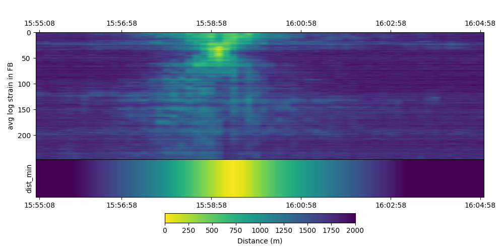

# Vessel Detection and Localization Using Distributed Acoustic Sensing in Submarine Optical Fiber Cables


> 📢 **Note:** **Upon formal publication of the paper describing this work (if accepted), the full dataset and processing scripts will be published under an open license in [Zenodo](https://zenodo.org), and this repository will be updated to its final form. This release will enable other researchers to fully reproduce our machine-learning experiments, compare new algorithms, and extend vessel-detection efforts in other submarine-cable contexts. For interested researchers we initially provide here a reduced version of the full dataset (10 minutes of the original 10 days processed recordings), to give an idea of the expected full content.**

This repository accompanies the research on vessel detection and localization using Distributed Acoustic Sensing (DAS) technology applied to submarine telecommunication cables. The project leverages repurposed submarine fiber optic cables as large-scale acoustic sensor arrays to continuously monitor maritime traffic and detect vessels in real time. 

The work is specifically aimed at submarine cable protection applications, in which the detection and localization of nearby vessels is crucial to monitor potential threats to the cable integrity. 

For in-depth details on dataset acquisition, instrumentation, and methodology, please refer to the manuscript (see the [citation section](#How-to-Cite)).

---

# Table of Contents

- [Project Summary](#project-summary)
- [Dataset Description](#dataset-description)
- [Database partitioning recommendations](#database-partitioning-recommendations)
- [Data Loading and Processing](#data-loading-and-processing)
- [Setup Instructions](#setup-instructions)
- [How to Cite](#how-to-cite)
- [Funding and Acknowledgements](#funding-and-acknowledgements)
- [Contact](#contact)

---

# Project Summary

Submarine cables are critical infrastructure for global connectivity but vulnerable to accidental damage or sabotage. Traditional vessel monitoring methods (SAR, video surveillance, satellite imagery) have real-time processing, weather, or range limitations.

This project exploits DAS sensors embedded in submarine cables to detect and localize vessels based on acoustic signals. The system operates continuously, independently of vessel cooperation (e.g., AIS), and performs robustly regardless of environmental conditions.

The dataset corresponds to a continuous ten-day DAS recording campaign, encompassing diverse vessel types, sizes, and speeds, in a 26 km long submarine optical fiber cable. The data selected for this work covers a 2,553 m fiber length segment with 250 spatial sensor channels sampled over time. 

> **Data Sharing Constraints and Our Alternative**
> Due to the data‐owner’s restrictions, we are unable to publish the original raw differential‐strain recordings nor details on precise geographical localization. Instead, we commit to full transparency and reproducibility by releasing preprocessed feature vectors (energy‐band values over 10 second windows) along with comprehensive labelling metadata (timestamps, distance to nearest vessel, and vessel information) and example code. The GitHub repository also documents the exact data schema, loading routines, and processing steps. The data will be publicly available once the manuscript describing our proposal is, if accepted, formally published (see the [citation section](#How-to-Cite)). Hosting will be done in Zenodo under an open license, ensuring that future researchers can reproduce our results without compromising the owner’s raw data agreements.


---

# Dataset Description

## Overview

In the dataset, we have a total of `N_samples` data points recorded along time, in which each data sample corresponds to feature vectors with `N_bands` energy-band values extracted from non-overlapped 10-second windows of the raw DAS strain signals, calculated for all the considered `N_channels` fiber optic sensing positions. The analyzed bandwidth covers an `(f_ini, f_end)` frequency range, excluding selected frequencies (see below). 

In our case, the spectral analysis produces `N_bands=100` logarithmically spaced energy values between 4 Hz and 98 Hz (more details in the [Feature extraction process](feature extraction process section)), for each of the considered `N_channels=250` spatial channels. So, each resulting feature vector for a given timestamp is of shape `(N_channels, N_bands)=(250, 100)`. 

In the 10 days recording period, we finally generated `N_samples=74771` feature vectors, so that the full data is of dimension `(N_samples, N_channels, N_bands)=(74771, 250, 100)`. The analized bandwidth uses `f_ini=4 Hz` and `f_end=98 Hz`, excluding the `(48 Hz, 52 Hz)` range (see the paper for the rationale).

The selected format for the dataset files is HDF5. 

> **Quick-Start Dataset for Rapid Testing**
>
> For convenience and quick reproducibility, we provide an aggregate HDF5 file named **`data/reduced_dataset_sensor_range_1440_1690.h5`**.  
> This file contains a 10-minute extract of the full dataset, including a representative ship crossing event.
> It is ideal for rapid testing, without requiring the full dataset download.


## Key dataset components

- `X`: A 3D NumPy array of shape `(N_samples, N_channels, N_bands)`.

  - **`N_samples=74771`**: number of non-overlapped 10-seconds signal windows analyzed along the full recording period.
  - **`N_channels=250`**: number of spatial channels (sensor positions along the selected fiber segment).
  - **`N_bands=100`**: number of energy-band features per channel, computed by dividing the `(f_ini,f_end)` bandwidth into 100 logarithmically spaced frequency bands and integrating power over each band in a 10-second window.
- `y`: A 1D NumPy array of shape `(N_samples,)` containing the distance (in meters) to the closest vessel during each 10-second window. This continuous variable supports regression tasks directly, or can be converted into classification labels by applying user-defined distance thresholds. 
- `datetimes`: An array of strings in the HDF5 file that records the UTC timestamp  (ISO-8601 format) corresponding to each 10-second window, with shape `(N_samples,)`.
- `ship_info`: A group in the HDF5 containing AIS metadata (vessel type, length, beam) of the vessel used to generate `y` label.

> **Note on Noisy Sensors**
>
> Three sensors (indices 59, 60, and 61 in the 'X' array) consistently exhibited high noise levels and have been forced to zero in the raw data. We recommend excluding these channels from feature matrices prior to training classification or regression models.


## Feature extraction processes

This section provides details on the processing from differential strain phase raw DAS to `(N_samples, N_channels, N_bands)` feature vectors. The feature generation process decisions are guided in a purely data driven approach (see the manuscript for details), where the main processing steps are: 

1. **Continuous DAS recording (raw signals):**

   - A differential strain phase-measuring interrogator (Alcatel OptoDAS, located in an off-shore platform) recorded differential phase at a sampling frequency of `f_s=3125 Hz` from a pre-existing ocean-bottom optical fiber cable, configured with `L=10.21 m` gauge length, yielding around 2600 raw spatial channels along the 26 km of fiber.
   - For our experiments, a contiguous 2553-meter fiber segment was selected, corresponding to `N_channels=250` spatial channels (each of them \~10.21 m apart), located between 14707 and 17260 meters from the interrogator.

2. **Windowing into 10-second frames:**

   - The raw differential strain phase DAS time series on each channel was converted to absolute strain and partitioned into non-overlapping 10-second windows. At the used `f_s`, each 10-seconds window contains 31250 time samples per channel.

3. **Spectral feature extraction (`N_bands=100` energy bands):**

   - For each 10-seconds window and for each of the `N_channels` channels, the power spectral density (PSD) between `f_ini=4 Hz` and `f_end=98 Hz` was computed, using a FFT analysis with `N_FFT=31250` FFT samples, and excluding the `(48 Hz, 52 Hz)` frequency range (see the paper for details).
   - That spectral range was split into **`N_bands=100`** logarithmically spaced frequency bands. The total power in each band was integrated to produce one energy value per band. File [fbands.csv](https://raw.githubusercontent.com/UAH-PSI/das-vessel-detection/refs/heads/main/fbands.csv?token=GHSAT0AAAAAAC6GANYY6Z2BYXFKI4APHJ5O2CB7DYQ) contains the frequency band limits for reference purposes.
   - The final result for each 10-second long signal window is a `(N_channels, N_bands)=(250, 100) “energy-band” matrix.


## Ground truth labeling generation processes

The dataset provides ground truth labels related to the distance from the fiber to the closest vessel. This involves two processes: 

1. AIS data interpolation and time alignment

   The original AIS positions provided by the data owner were interpolated at a reporting period of 1 second to improve the spatial and temporal resolution, aligning each vessel’s location with the timestamp corresponding to the middle point of each 10-seconds DAS window (which is stored in the `datetimes` array).

2. Computing closest-vessel distance using AIS data:

   For every timestamped window, we calculate the Euclidean distance from the cable to each AIS reported vessel, then take the minimum distance as the “closest‐vessel distance”. This continuous value (in meters) is stored in the `y` array for that timestamp.


## Data availability

> 📢 **Note:** The link to the Zenodo page hosting the dataset will be available upon formal publication of the paper describing this work (if accepted)

The dataset is available at Zenodo at [Marlinks-NorthSea dataset](https://doi.org/10.5281/zenodo.15611778). 


## Data packaging into HDF5


   - All processed windows produce `N_samples` feature matrices of shape `(N_channels, N_bands)`, stacked into `X`.
   - Corresponding labels go into `y`, and UTC timestamps into `datetimes`.
   - Optionally, the raw AIS metadata (vessel type, speed, MMSI) are stored under `ship_info`.

By framing each 10-seconds interval as a `(N_channels, N_bands)` energy-band snapshot, this dataset enables machine-learning models to learn vessel detection and distance-estimation based on both spatial patterns (across neighboring fiber channels), temporal patterns (across neighboring timestamps) and spectral content.

---

# Database Partitioning Recommendations

To rigorously evaluate our vessel‐detection and localization models while avoiding temporal leakage, we partitioned the 10-day Marlinks-NS dataset using a day-wise, 10-fold cross-validation scheme.  Each of the 10 folds corresponds to one full day of DAS + AIS recordings.  For each iteration, models were trained on the nine other days and tested on the held-out day, ensuring no temporally adjacent samples span both training and testing sets.  This approach preserves within-fold temporal continuity, injects greater variability into training, and yields a more reliable estimate of generalization performance.  Notably, only 11 vessels (out of 565 total) appear in more than half of the folds, underscoring the dataset’s challenge and the robustness of our partitioning strategy.


---

# Data Loading and Processing

Data loading is handled via a Python script (`load_and_split_dataset.py`) that performs the following tasks:

1. Open the HDF5 file in read-only mode using `h5py`.
2. Extract arrays `X`, `y`, and `datetimes`.
3. Convert `datetimes` from byte strings to UTF-8 and then to pandas `Timestamp` objects.
4. Use an ISO 8601 datetime cutoff string to split the dataset temporally into training and testing sets, facilitating k-fold or temporal cross-validation.
5. Optionally load `ship_info` if available.

An example snippet loading the dataset follows:

```python
import h5py
import numpy as np
import pandas as pd

def load_dataset(hdf5_path, datetime_cutoff=None):
    with h5py.File(hdf5_path, 'r') as f:
        X = f['X'][:]  # Shape: (N_samples, 250, 100)
        y = f['y'][:]
        datetimes_bytes = f['datetimes'][:]
        datetimes_str = [dt.decode('utf-8') for dt in datetimes_bytes]
        datetimes = pd.to_datetime(datetimes_str)
        
        ship_info = f.get('ship_info')
        if ship_info is not None:
            ship_info = {key: ship_info[key][:] for key in ship_info.keys()}
    
    if datetime_cutoff is not None:
        cutoff = pd.to_datetime(datetime_cutoff)
        train_mask = datetimes <= cutoff
        test_mask = datetimes > cutoff
        
        X_train, y_train = X[train_mask], y[train_mask]
        X_test, y_test = X[test_mask], y[test_mask]
    else:
        X_train = X_test = y_train = y_test = None
    
    return {
        'X': X,
        'y': y,
        'datetimes': datetimes,
        'ship_info': ship_info,
        'X_train': X_train,
        'y_train': y_train,
        'X_test': X_test,
        'y_test': y_test,
    }
```

---

# Setup Instructions

To work with this project and load the dataset, follow these detailed setup steps:

## Prerequisites

- Python 3.8 or higher is recommended.
- `pip` package manager installed.

## Create a Python Virtual Environment (Highly Recommended)

On Windows (PowerShell):

```powershell
python -m venv venv
.\venv\Scripts\Activate.ps1
```

On Linux/macOS:

```bash
python3 -m venv venv
source venv/bin/activate
```

## Upgrade pip (Optional but Recommended)

```bash
pip install --upgrade pip
```

## Install Required Python Packages

```bash
pip install -r requirements.txt
```

## Run the Data Loading Script

Ensure the HDF5 dataset file path is correctly specified and accessible. Use the provided `load_and_split_dataset.py` script or the `load_dataset()` function example above to load and split the dataset temporally.

The `load_and_split_dataset.py` script loads an HDF5 file containing `X`, `y`, and `datetimes`, then splits them into training and testing sets based on a specified ISO date. All samples whose timestamp (UTC) falls on the given date are reserved for testing; the rest become the training set. Results are saved as NumPy arrays in the chosen output directory.

The relevant command line options are:

- `--h5_path`: Path to your HDF5 dataset (e.g., `dataset_sensor_range_1440_1690.h5`).

- `--test_date`: UTC ISO‐formatted date (`YYYY-MM-DD`) marking which samples to hold out for testing.

- `--output_dir`: Directory where the script will save:

  - `X_train.npy`, `X_test.npy`
  - `y_train.npy`, `y_test.npy`
  - `datetimes_train.npy`, `datetimes_test.npy`
  - `*Optional*` `ship_info_train.npz`, `ship_info_test.npz` if `ship_info` is present.

This is an example of how to run the script:

```bash
python src/load_and_split_dataset.py --h5_path /path/to/dataset_sensor_range_1440_1690.h5 --test_date 2023-06-16 --output_dir ./splits/
```

After running the command above, you should see an output similar to:

```
Loaded data: X.shape = (N, 250, 100), y.shape = (N,), datetimes.shape = (N,)
Splitting data: M training samples, K testing samples.
Train/test splits saved in directory: ./splits/
```

Adjust `--h5_path`, `--test_date`, and `--output_dir` as needed for your workflow.

---

## Example Plotting Script and Output Figure

A companion script for visualizing feature and distance data is provided at:

- [`/src/plot_energy_distance.py`](src/plot_energy_distance.py)

This script can be used to generate combined energy-band and vessel-distance diagrams directly from the reduced HDF5 dataset.  
You can quickly produce a figure with a command such as:

```bash
python src/plot_energy_distance.py --h5 /data/reduced_dataset_sensor_range_1440_1690.h5  --time_interval 2023-06-16T15:55:00+00:00 2023-06-26T16:05:00+00:00  --save_dir /data --remove_channels 59 60 61
```

The example below shows the resulting plot, created from the provided 10-minute reduced dataset:




# How to Cite

If you use these data or code in your work, please cite the following paper:

> **Vessel Detection and Localization Using Distributed Acoustic Sensing in Submarine Optical Fiber Cables**
> Erick Eduardo Ramirez-Torres, Javier Macias-Guarasa, Daniel Pizarro-Perez, Javier Tejedor, Sira Elena Palazuelos-Cagigas, Pedro J. Vidal-Moreno, Sonia Martin-Lopez, Miguel Gonzalez-Herraez, Roel Vanthillo.
> Submitted to IEEE Transactions on Geoscience & Remote Sensing, 2025.
>
> DOI: *(to be assigned upon publication, if the paper is accepted)*

---

# Funding and Acknowledgements

This work has been partially supported by the Spanish Ministry of Science and Innovation MCIN/AEI/10.13039/501100011033 and by the European Union NextGenerationEU/PRTR program under grants PSI (PLEC2021-007875), REMO (CPP2021-008869) and EYEFUL-UAH (PID2020-113118RB-C31); by FEDER Una manera de hacer Europa under grant PRECISION (PID2021-128000OBC21); by the European Innovation Council under grants SAFE (101098992) and grant SUBMERSE (101095055).
    
P.J.V-M was supported by FPI-2021 Grant from the University of Alcalá Research Program.

We gratefully acknowledge the computer resources at Artemisa, funded by the European Union ERDF and Comunitat Valenciana as well as the technical support provided by the Instituto de Fisica Corpuscular, IFIC (CSIC-UV).
  


# Contact

If you have further questions or require additional assistance, please contact the corresponding author via email at [javier.maciasguarasa@uah.es](mailto:javier.maciasguarasa@uah.es).
