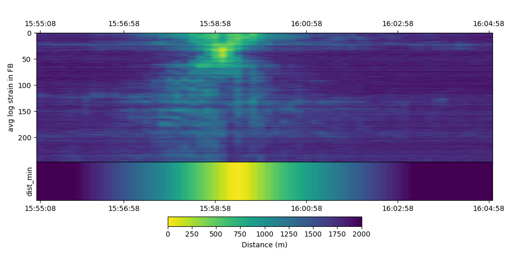

# Vessel Detection and Localization Using Distributed Acoustic Sensing in Submarine Optical Fiber Cables

[](https://doi.org/10.1109/JSTARS.2026.3716768)
[](https://doi.org/10.5281/zenodo.15611778)
[](#related-publications)
[](LICENSE)

## Repository purpose

This repository is the maintained companion software and reproducibility resource for research on vessel monitoring using distributed acoustic sensing (DAS) in submarine optical fiber cables. It supports:

- the published IEEE JSTARS article on vessel detection and localization;
- the submitted *Scientific Data* Data Descriptor presenting the Marlinks-NS DAS dataset; and
- the [Marlinks-NS DAS dataset deposited in Zenodo](https://doi.org/10.5281/zenodo.15611778).

The complete dataset and its definitive documentation are distributed through Zenodo. This repository contains complementary source code, reproducibility workflows, plotting tools, frequency-band definitions, a small demonstration dataset and supplementary resources.

## Project summary

Submarine cables are critical infrastructure for global connectivity, but they are vulnerable to accidental damage and deliberate interference. Conventional vessel-monitoring technologies can be limited by sensing range, weather conditions, revisit times or dependence on vessel cooperation.

This project investigates the use of DAS on a pre-existing ocean-bottom telecommunication cable for continuous maritime monitoring and submarine-cable protection. DAS turns the optical fiber into a dense array of acoustic sensing positions, enabling machine-learning methods to detect nearby vessels and estimate their distance to the cable.

The Marlinks-NS measurements were acquired over ten days using a 28 km submarine optical fiber cable. The released dataset contains processed spatial-spectral DAS features from a selected 2,553 m segment, together with timestamps, closest-vessel distance labels and AIS-derived vessel information.

The original raw DAS recordings, the precise cable route and other sensitive geographical details cannot be released because of data-owner and critical-infrastructure restrictions. Instead, the openly released dataset provides the processed features and metadata needed to reproduce the defined machine-learning tasks. See the Zenodo documentation for the authoritative description of the acquisition, processing, data structure, limitations and permitted use.

## Dataset availability

The complete released dataset is available from Zenodo:

> **Marlinks-NS DAS: Dataset for vessel detection and distance estimation using distributed acoustic sensing in submarine optical fiber cables**  
> [https://doi.org/10.5281/zenodo.15611778](https://doi.org/10.5281/zenodo.15611778)

The Zenodo record is the authoritative source for:

- the complete processed HDF5 dataset;
- the definitive dataset documentation and file inventory;
- the HDF5 schema and field descriptions;
- acquisition, processing and ground-truth generation details;
- known limitations and usage considerations;
- dataset licensing and citation metadata; and
- minimal standalone examples for inspecting, loading, validating and partitioning the data.

This GitHub repository also retains `data/reduced_dataset_sensor_range_1440_1690.h5`, a 10-minute extract containing a representative vessel-crossing event. It is provided only as a lightweight demonstration asset for rapidly testing the repository scripts; it is not an alternative distribution of the complete dataset.

## Minimal dataset summary

| Property | Value |
|---|---|
| Recording period | 16–25 June 2023 (UTC) |
| Observation window | 10 s, non-overlapping |
| Number of observations | 74,771 |
| Selected cable segment | 2,553 m |
| Spatial channels | 250 |
| Spectral features | 100 logarithmically spaced energy bands |
| Retained frequency range | 4–98 Hz, excluding 49–51 Hz |
| Main feature array | `X.shape = (74771, 250, 100)` |
| Regression target | Distance in metres to the closest AIS-reported vessel |
| Additional information | UTC timestamps and AIS-derived vessel attributes |

Each feature value is obtained by integrating the squared FFT magnitude over its corresponding frequency band. Three noisy spatial channels, with array indices `59`, `60` and `61`, were set to zero in the released feature matrices and should normally be excluded before model training or evaluation.

The dataset supports two principal tasks:

1. **Vessel detection:** binary classification obtained by applying a stated distance threshold to the continuous target.
2. **Vessel-to-cable distance estimation:** regression using the continuous closest-vessel distance.

For the complete and current technical description, refer to the documentation in the [Zenodo record](https://doi.org/10.5281/zenodo.15611778).

## Repository contents

The main repository resources include:

| Path | Purpose |
|---|---|
| `src/` | Dataset loading, partitioning, plotting and reproducibility scripts |
| `data/reduced_dataset_sensor_range_1440_1690.h5` | Ten-minute demonstration extract |
| `data/fbands.csv` | Frequency-band boundaries used for feature extraction |
| `data/combined_plot_interval_20230616T155500_20230626T160500.png` | Example visualization generated from the demonstration data |
| `requirements.txt` | Python package requirements |
| `logos/` | Funding and acknowledgement graphics |
| `LICENSE` | Licence applying to the repository software |

The repository is the actively maintained location for software updates and extended reproducibility material. The complete released data remain versioned and preserved in Zenodo.

## Installation

Clone the repository and create an isolated environment:

```bash
git clone https://github.com/UAH-PSI/das-vessel-detection.git
cd das-vessel-detection

python3 -m venv .venv
source .venv/bin/activate
python -m pip install --upgrade pip
python -m pip install -r requirements.txt
```

On Windows PowerShell, activate the environment with:

```powershell
.\.venv\Scripts\Activate.ps1
```

## Usage and reproducibility workflows

### Generate a day-wise train/test split

`src/load_and_split_dataset.py` loads `X`, `y`, `datetimes` and, when present, `ship_info`. It reserves all observations from the selected UTC date for testing and uses the remaining dates for training:

```bash
python src/load_and_split_dataset.py \
  --h5_path /path/to/dataset_sensor_range_1440_1690_0.h5 \
  --test_date 2023-06-16 \
  --output_dir ./splits/
```

The output directory contains:

- `X_train.npy` and `X_test.npy`;
- `y_train.npy` and `y_test.npy`;
- `datetimes_train.npy` and `datetimes_test.npy`; and
- when available, `ship_info_train.npz` and `ship_info_test.npz`.

Use the HDF5 file downloaded from Zenodo for complete experiments. The smaller HDF5 file in `data/` can be used to verify the workflow quickly.

### Plot energy features and vessel distance

`src/plot_energy_distance.py` generates a combined visualization of the energy-band features and vessel-distance labels. For example:

```bash
python src/plot_energy_distance.py \
  --h5 data/reduced_dataset_sensor_range_1440_1690.h5 \
  --time_interval 2023-06-16T15:55:00+00:00 2023-06-16T16:05:00+00:00 \
  --save_dir data \
  --remove_channels 59 60 61
```

Example output:



The Zenodo `src.zip` archive additionally provides small standalone examples for inspecting the HDF5 structure, loading all data or selected slices, checking consistency between full and sliced loading, and generating day-wise partitions.

## Data partitioning recommendation

The observations form a continuous time series and are temporally correlated. Randomly assigning individual 10-second windows to training and test sets can therefore cause temporal leakage and produce overly optimistic performance estimates.

We recommend the day-wise 10-fold cross-validation scheme used in the associated studies:

- each fold contains one complete recording day;
- models are trained on the other nine days; and
- the held-out day is used exclusively for testing.

The ten folds correspond to:

```text
2023-06-16
2023-06-17
2023-06-18
2023-06-19
2023-06-20
2023-06-21
2023-06-22
2023-06-23
2023-06-24
2023-06-25
```

Alternative partitions should preserve temporal separation between training and evaluation data, and the partitioning procedure should be reported explicitly.

## Supplementary material

The [project supplementary website](https://geintra-uah.org/psi/index.html) provides additional material supporting the JSTARS study, including visual demonstrations of the method under different conditions.

## Related publications

### IEEE JSTARS article

E. E. Ramirez-Torres, J. Macias-Guarasa, D. Pizarro-Perez, J. Tejedor, S. E. Palazuelos-Cagigas, P. J. Vidal-Moreno, S. Martin-Lopez, M. Gonzalez-Herraez and R. Vanthillo, “Vessel Detection and Localization Using Distributed Acoustic Sensing in Submarine Optical Fiber Cables,” *IEEE Journal of Selected Topics in Applied Earth Observations and Remote Sensing*, 2026.  
[https://doi.org/10.1109/JSTARS.2026.3716768](https://doi.org/10.1109/JSTARS.2026.3716768)

### Scientific Data Data Descriptor

E. E. Ramirez-Torres et al., “Marlinks-NS DAS: Dataset for vessel detection and distance estimation using distributed acoustic sensing in submarine optical fiber cables,” submitted to *Scientific Data*, 2026.

> **Preprint pending:** the arXiv citation, identifier and link will be added here as soon as the preprint is available.

## How to cite

If you use the dataset, repository software, methodology, experimental results or associated supplementary resources, please cite **both companion publications and the Zenodo dataset**. The three references document complementary aspects of the work: the machine-learning methodology and experiments, the dataset design and validation, and the specific released dataset.

Until the *Scientific Data* preprint is available, please cite the JSTARS article and the Zenodo dataset below. The third citation will be added as soon as its arXiv record is available.

### 1. IEEE JSTARS article

> E. E. Ramirez-Torres, J. Macias-Guarasa, D. Pizarro-Perez, J. Tejedor, S. E. Palazuelos-Cagigas, P. J. Vidal-Moreno, S. Martin-Lopez, M. Gonzalez-Herraez and R. Vanthillo, “Vessel Detection and Localization Using Distributed Acoustic Sensing in Submarine Optical Fiber Cables,” *IEEE Journal of Selected Topics in Applied Earth Observations and Remote Sensing*, 2026. https://doi.org/10.1109/JSTARS.2026.3716768

### 2. Scientific Data Data Descriptor

> **Citation pending.** The complete arXiv reference will be inserted here when the preprint is released.

### 3. Zenodo dataset

> E. E. Ramirez-Torres, J. Macias-Guarasa, D. Pizarro-Perez, J. Tejedor, S. E. Palazuelos-Cagigas, P. J. Vidal-Moreno, M. R. Fernández-Ruiz, S. Martin-Lopez, M. Gonzalez-Herraez and R. Vanthillo, “Marlinks-NS DAS: Dataset for vessel detection and distance estimation using distributed acoustic sensing in submarine optical fiber cables,” Zenodo. https://doi.org/10.5281/zenodo.15611778

## Licences

The components are distributed under separate licences:

- **Repository software:** [GNU General Public License v3.0](LICENSE), as specified in the repository `LICENSE` file.
- **Zenodo dataset:** [Creative Commons Attribution 4.0 International (CC BY 4.0)](https://creativecommons.org/licenses/by/4.0/), as specified in the Zenodo record.
- **Publications:** the licence stated by the corresponding publisher or preprint platform.

The demonstration HDF5 extract in this repository is data rather than software and is covered by the dataset licence. Users should consult the applicable licence files and records before redistribution or reuse.

## Funding and acknowledgements

This work was partially supported by:

- the Spanish Ministry of Science and Innovation, MCIN/AEI/10.13039/501100011033, and the European Union NextGenerationEU/PRTR programme under grants PSI (PLEC2021-007875), REMO (CPP2021-008869), NeurEYE-UAH (PID2024-156576OB-C31), SEASNAKE+ (PCI2023-145978-2, from the CETPartnership 2022 joint call), MOTION (PID2022-140963OA-I00) and EYEFUL-UAH (PID2020-113118RB-C31);
- the European Innovation Council under grants SAFE (101098992), SUBMERSE (101095055) and ECSTATIC (101189595);
- the European Research Council under grant SENSE (101218803);
- the University of Alcalá Research Programme through the FPI-2021 grant supporting P. J. Vidal-Moreno; and
- MCIN/AEI/10.13039/501100011033 and the European Union NextGenerationEU/PRTR under grant RYC2021-032167-I, supporting M. R. Fernández-Ruiz.

The authors acknowledge the computing resources provided by Artemisa, funded by the European Union ERDF and Comunitat Valenciana, and the technical support provided by the Instituto de Física Corpuscular, IFIC (CSIC–University of Valencia).


## Contact and issue reporting

For scientific questions about the dataset or the associated studies, contact:

**Javier Macias-Guarasa**  
Universidad de Alcalá  
[javier.maciasguarasa@uah.es](mailto:javier.maciasguarasa@uah.es)

For reproducibility problems, software defects or feature requests, please use the repository [issue tracker](https://github.com/UAH-PSI/das-vessel-detection/issues). When reporting a problem, include the command executed, relevant input and output paths, the observed error and enough environment information to reproduce it.
