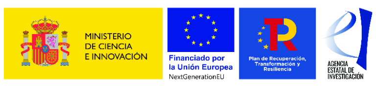

# Vessel Detection and Localization Using Distributed Acoustic Sensing in Submarine Optical Fiber Cables

[](https://doi.org/10.1109/JSTARS.2026.3716768)
[](https://doi.org/10.5281/zenodo.15611778)
[](https://doi.org/10.48550/arXiv.2607.28306)
[](LICENSE)


## Repository purpose

This repository provides the maintained companion software and reproducibility resources for our research group's work on vessel monitoring using distributed acoustic sensing (DAS) in submarine optical fiber cables. It supports:

1. The published [Marlinks-NS DAS dataset deposited in Zenodo](https://doi.org/10.5281/zenodo.15611778).
2. The accepted [IEEE JSTARS article](https://doi.org/10.1109/JSTARS.2026.3716768) describing our vessel-detection and localization methodology and experiments.
3. The [ArXiV preprint documenting and validating the Marlinks-NS dataset](https://doi.org/10.48550/arXiv.2607.28306) (submitted to be considered for publication as a Data Descriptor in the *Scientific Data* journal).

The complete dataset and its definitive documentation are distributed through Zenodo. This repository contains complementary source code, reproducibility workflows, plotting tools, frequency-band definitions, a small demonstration dataset and supplementary resources, and will be updated with additional source-code tools and reproducibility material.

## Table of contents

- [Project summary](#project-summary)
- [Dataset availability](#dataset-availability)
- [Repository contents](#repository-contents)
- [Usage and reproducibility workflows](#usage-and-reproducibility-workflows)
  - [Installation](#installation)
  - [Data partitioning recommendation](#data-partitioning-recommendation)
  - [Generation of a day-wise k-fold train-test split](#generation-of-a-day-wise-k-fold-traintest-split)
  - [Plot energy features and vessel distance](#plot-energy-features-and-vessel-distance)
  - [Baseline AI/ML experiments](#baseline-aiml-experiments)
- [Supplementary material](#supplementary-material)
- [How to cite](#how-to-cite)
- [Licenses](#licenses)
- [Funding and acknowledgements](#funding-and-acknowledgements)
- [Contact and issue reporting](#contact-and-issue-reporting)

## Project summary

Submarine cables are critical infrastructure for global connectivity, but they are vulnerable to accidental damage and deliberate interference. Conventional vessel-monitoring technologies can be limited by sensing range, weather conditions, revisit times or dependence on vessel cooperation.

This project investigates the use of DAS on a pre-existing ocean-bottom telecommunications cable for continuous maritime monitoring and submarine-cable protection. DAS turns the optical fiber into a dense array of acoustic sensing positions, enabling machine-learning methods to detect nearby vessels and estimate their distance to the cable.

The Marlinks-NS measurements were acquired over ten days using a 28 km submarine optical fiber cable. The released dataset contains processed spatial-spectral DAS features from a selected 2,553 m segment, together with timestamps, closest-vessel distance labels and AIS-derived vessel information.

The original raw DAS recordings, the precise cable route and other sensitive geographical details cannot be released because of data-owner and critical-infrastructure restrictions. Instead, the openly released dataset provides the processed features and metadata needed to reproduce the defined machine-learning tasks. See the Zenodo documentation for the authoritative description of the acquisition, processing, data structure, limitations and permitted use.

## Dataset availability

The complete released dataset is available from Zenodo:

> **Marlinks-NS DAS Dataset for vessel detection and distance estimation using distributed acoustic sensing in submarine optical fiber cables**  
> [https://doi.org/10.5281/zenodo.15611778](https://doi.org/10.5281/zenodo.15611778)

The Zenodo record is the authoritative source for:

- The complete processed HDF5 dataset.
- The definitive dataset documentation and file inventory.
- The HDF5 schema and field descriptions.
- Acquisition, processing and ground-truth generation details.
- Known limitations and usage considerations.
- Dataset licensing and citation metadata.
- Minimal standalone examples for inspecting, loading, validating and partitioning the data.

This GitHub repository also retains `data/reduced_dataset_sensor_range_1440_1690.h5`, a 10-minute extract containing a representative vessel-crossing event. It is provided only as a lightweight demonstration asset for rapidly testing the repository scripts; it is not an alternative distribution of the complete dataset.

The released HDF5 file contains 74,771 sample-aligned observations:

| Element     |                                                  Shape | Contents                                                                                                                                   |
|-------------|-------------------------------------------------------:|--------------------------------------------------------------------------------------------------------------------------------------------|
| `X`         |                                    `(74771, 250, 100)` | DAS energy-band features, ordered as `(sample, spatial channel, frequency band)`                                                           |
| `y`         |                                             `(74771,)` | Distance in meters to the closest AIS-reported vessel for each observation                                                                 |
| `datetimes` |                                             `(74771,)` | UTC timestamps corresponding to each observation, formatted as `%Y-%m-%d %H:%M:%S%z` following Python’s `strftime` format-code conventions |
| `ship_info` | HDF5 group containing three arrays of shape `(74771,)` | AIS-derived vessel type, length and beam of the closest vessel associated with each observation                                            |

Thus, each sample consists of one `250 × 100` spatial-spectral feature matrix in `X`, one closest-vessel distance in `y`, the corresponding vessel attributes in `ship_info`, and one timestamp. The observations cover 16–25 June 2023 (UTC) and correspond to non-overlapping 10-second windows over a 2,553 m cable segment. The 100 spectral features are logarithmically spaced energy bands spanning 4–98 Hz, excluding 49–51 Hz.

Each feature value is obtained by summing the squared magnitudes of the one-sided, Blackman-windowed FFT coefficients within the corresponding frequency band. Three noisy spatial channels, with array indices `59`, `60` and `61`, were set to zero in the released feature matrices and should normally be excluded before model training or evaluation.

The dataset supports two principal tasks:

1. **Vessel detection:** binary classification obtained by applying a stated distance threshold to the continuous target.
2. **Vessel-to-cable distance estimation:** regression using the continuous closest-vessel distance.

For the complete and current technical description, refer to the documentation in the [Zenodo record](https://doi.org/10.5281/zenodo.15611778).

## Repository contents

The main repository resources include:

| Path                                             | Purpose                                                             |
|--------------------------------------------------|---------------------------------------------------------------------|
| `src/`                                           | Dataset loading, partitioning, plotting and reproducibility scripts |
| `models/`                                        | Public baseline XGBoost classification and regression models        |
| `scripts/`                                       | Maintained launchers for the best baseline experiment configurations |
| `data/reduced_dataset_sensor_range_1440_1690.h5` | Ten-minute demonstration extract                                    |
| `data/fbands.csv`                                | Frequency-band boundaries used for feature extraction               |
| `data/combined_plot_interval_...0.png`           | Example visualization generated from the demonstration data         |
| `requirements.txt`                               | Python package requirements                                         |
| `logos/`                                         | Funding and acknowledgment graphics                                 |
| `LICENSE`                                        | License applying to the repository software                         |

The repository is the actively maintained location for software updates and extended reproducibility material. The complete released data remain versioned and preserved in Zenodo.


## Usage and reproducibility workflows

### Installation

Clone the repository and create an isolated environment:

```bash
git clone https://github.com/UAH-PSI/das-vessel-detection.git
cd das-vessel-detection

python3 -m venv .venv
source .venv/bin/activate
python -m pip install --upgrade pip
python -m pip install -r requirements.txt
```

On Windows PowerShell, activate the environment with:

```powershell
.\.venv\Scripts\Activate.ps1
```

### Data partitioning recommendation

The observations form a continuous time series and are temporally correlated. Randomly assigning individual 10-second windows to training and test sets can therefore cause temporal leakage and produce overly optimistic performance estimates.


The reproducibility workflows follow the day-wise 10-fold, leave-one-day-out cross-validation strategy adopted in the associated studies. Each of the ten recording days defines one fold: in each cross-validation iteration, all observations from one complete day are held out for testing, while observations from the remaining nine days are used for model development. If a separate validation set is required, it should also be defined using temporally separated observations, preferably by holding out one or more complete training days.

The ten folds correspond to the dataset recording days:

```text
2023-06-16
2023-06-17
2023-06-18
2023-06-19
2023-06-20
2023-06-21
2023-06-22
2023-06-23
2023-06-24
2023-06-25
```

To ensure direct comparability with the associated studies, users are encouraged to retain the proposed day-wise partitioning strategy. If an alternative partitioning approach is adopted, it should preserve temporal separation between training and evaluation data, minimize temporal leakage, and be reported explicitly.


### Generation of a day-wise (k-fold) train/test split

`src/load_and_split_dataset.py` loads `X`, `y`, `datetimes` and, when present, `ship_info`. It reserves all observations from the selected recording day for testing and uses the remaining days for training:

```bash
python src/load_and_split_dataset.py \
  --h5_path /path/to/dataset_sensor_range_1440_1690_0.h5 \
  --test_date 2023-06-16 \
  --output_dir ./splits/
```

The output directory contains:

- `X_train.npy` and `X_test.npy`.
- `y_train.npy` and `y_test.npy`.
- `datetimes_train.npy` and `datetimes_test.npy`.
- When available, `ship_info_train.npz` and `ship_info_test.npz`.

Use the HDF5 file downloaded from Zenodo for complete experiments. 

### Plot energy features and vessel distance

`src/plot_energy_distance.py` generates a combined visualization of the energy-band features and vessel-distance labels. For example:

```bash
python src/plot_energy_distance.py \
  --h5 data/reduced_dataset_sensor_range_1440_1690.h5 \
  --time_interval 2023-06-16T15:55:00+00:00 2023-06-16T16:05:00+00:00 \
  --save_dir data \
  --remove_channels 59 60 61
```

Example output:


The Zenodo `src.zip` archive additionally provides small standalone examples for inspecting the HDF5 structure, loading all data or selected slices, checking consistency between full and sliced loading, and generating day-wise partitions.

### Baseline AI/ML experiments (supporting the [JSTARS journal](#2.-ieee-jstars-accepted-article))

The public repository includes the experiment runner and the baseline XGBoost models for vessel detection (classification) and vessel-distance estimation (regression) that are referenced in the [JSTARS journal](#2.-ieee-jstars-accepted-article). Run commands from the repository root after completing the [installation](#installation).

The included ten-minute HDF5 extract is useful for loading and plotting checks, but it does not contain the complete set of daily folds. Download the full dataset from [Zenodo](https://doi.org/10.5281/zenodo.15611778) before running the all-fold experiments, then either place it at `data/dataset_sensor_range_1440_1690_0.h5` or change `--h5_path` in the commands.

Start with these documents:

| Guide                                                                  | Purpose                                                                    |
|------------------------------------------------------------------------|----------------------------------------------------------------------------|
| [README-run-experiments.md](README-run-experiments.md)                 | Installation, baseline commands, result files, MLflow, and result analysis |
| [README-develop-models.md](README-develop-models.md)                   | Reference documentation for adding classification or regression models     |
| [README-tutorial-develop-models.md](README-tutorial-develop-models.md) | Step-by-step model-development tutorial                                    |
| [EXPERIMENT-KNOWN-ISSUES.md](EXPERIMENT-KNOWN-ISSUES.md)               | Active limitations, workarounds, and resolution criteria                   |

The two maintained baseline launchers that replicate the best experiments in the [JSTARS journal](#2.-ieee-jstars-accepted-article) are:

- `scripts/run_xgb_classif_baseline_all_folds-best.sh`: 
- `scripts/run_xgb_regress_baseline_all_folds-best-1000-avg_chann.sh`


They use:

- `models/baseline_xgb_classification_model.py`;
- `models/baseline_xgb_regression_model.py`;
- `src/model_experiment_hdf5.py`.

Review the known-issues document before interpreting results. In particular, the current evaluator is binary, classification AUC after temporal smoothing has a known probability-alignment limitation, and the persisted date-range model is the model trained for the final fold.


## Supplementary material

The [JSTART paper supplementary website](https://geintra-uah.org/psi/index.html) provides additional material supporting the JSTARS study, including visual demonstrations of the method under different conditions.


## How to cite

If you use the dataset, repository software, methodology, experimental results or associated supplementary resources, please cite the following related research outputs:

- The published [Marlinks-NS DAS dataset deposited in Zenodo](https://doi.org/10.5281/zenodo.15611778).
> E. E. Ramirez-Torres, J. Macias-Guarasa, D. Pizarro, J. Tejedor, S. E. Palazuelos-Cagigas, P. J. Vidal-Moreno, M. R. Fernández-Ruiz, S. Martin-Lopez, M. Gonzalez-Herraez and R. Vanthillo, “Marlinks-NS DAS Dataset for vessel detection and distance estimation using distributed acoustic sensing in submarine optical fiber cables”, Zenodo. doi: [10.5281/zenodo.15611778](https://doi.org/10.5281/zenodo.15611778)
- The accepted [IEEE JSTARS article](https://doi.org/10.1109/JSTARS.2026.3716768) describing our vessel-detection and localization methodology and experiments.
> E. E. Ramirez-Torres, J. Macias-Guarasa, D. Pizarro, J. Tejedor, S. E. Palazuelos-Cagigas, P. J. Vidal-Moreno, S. Martin-Lopez, M. Gonzalez-Herraez and R. Vanthillo, “Vessel Detection and Localization Using Distributed Acoustic Sensing in Submarine Optical Fiber Cables”. Accepted for publication in the IEEE Journal of Selected Topics in Applied Earth Observations and Remote Sensing, 2026. doi: [10.1109/JSTARS.2026.3716768](https://doi.org/10.1109/JSTARS.2026.37167)
- The [ArXiV preprint documenting and validating the Marlinks-NS dataset](https://doi.org/...) (submitted to be considered for publication as a Data Descriptor to the *Scientific Data* journal).
> E. E. Ramirez-Torres, J. Macias-Guarasa, D. Pizarro, J. Tejedor, S. E. Palazuelos-Cagigas, P. J. Vidal-Moreno, S. Martin-Lopez, M. Gonzalez-Herraez and R. Vanthillo, *“A Distributed Acoustic Sensing Dataset for Vessel Detection and Localization in Submarine Cable Protection”*. ArXiv preprint arXiv:2509.11614. doi: [10.48550/arXiv.2607.28306](https://doi.org/10.48550/arXiv.2607.28306)


## Licenses

The components are distributed under separate licenses:

- **Repository software:** [GNU General Public License v3.0](LICENSE), as specified in the repository `LICENSE` file.
- **Zenodo dataset:** [Creative Commons Attribution 4.0 International (CC BY 4.0)](https://creativecommons.org/licenses/by/4.0/), as specified in the Zenodo record.
- **Publications:** the license stated by the corresponding publisher or preprint platform.

The demonstration HDF5 extract in this repository is data rather than software and is covered by the dataset license. Users should consult the applicable license files and records before redistribution or reuse.


## Funding and acknowledgements

This work was partially supported by:

- The Spanish Ministry of Science and Innovation, MCIN/AEI/10.13039/501100011033, and the European Union NextGenerationEU/PRTR programme under grants PSI (PLEC2021-007875), REMO (CPP2021-008869), NeurEYE-UAH (PID2024-156576OB-C31), SEASNAKE+ (PCI2023-145978-2, from the CETPartnership 2022 joint call), MOTION (PID2022-140963OA-I00) and EYEFUL-UAH (PID2020-113118RB-C31).
- The European Innovation Council under grants SAFE (101098992), SUBMERSE (101095055) and ECSTATIC (101189595).
- The European Research Council under grant SENSE (101218803).
- The University of Alcalá Research Programme through the FPI-2021 grant supporting P. J. Vidal-Moreno.
- MCIN/AEI/10.13039/501100011033 and the European Union NextGenerationEU/PRTR under grant RYC2021-032167-I, supporting M. R. Fernández-Ruiz.

The authors acknowledge the computing resources provided by Artemisa, funded by the European Union ERDF and Comunitat Valenciana, and the technical support provided by the Instituto de Física Corpuscular, IFIC (CSIC–University of Valencia).



## Contact and issue reporting

For questions about the dataset or the associated studies, please contact:

**Javier Macias-Guarasa**  
Universidad de Alcalá  
[javier.maciasguarasa@uah.es](mailto:javier.maciasguarasa@uah.es)

For source-code issues, contributions, or feature requests, please use the repository [issue tracker](https://github.com/UAH-PSI/das-vessel-detection/issues). When reporting an issue, include the command executed, relevant input and output data and paths, the observed error, and sufficient information about the execution environment to reproduce it.

<!-- Local Variables: -->
<!-- mode: markdown -->
<!-- ispell-local-dictionary: "en_US" -->
<!-- End: -->
